# ZoneAPI - Healthcare Appointment Management System

A production-ready RESTful API built with ASP.NET Core for managing healthcare appointments, doctors, and patients. The system is deployed on Azure using Kubernetes (AKS) with comprehensive security scanning, automated CI/CD pipelines, and extensive monitoring tools.

## 🏗️ Architecture

- **Backend**: ASP.NET Core 7.0 Web API
- **Database**: PostgreSQL (Azure Database for PostgreSQL - Flexible Server)
- **Container Registry**: Azure Container Registry (ACR) with security scanning
- **Orchestration**: Azure Kubernetes Service (AKS)
- **Infrastructure**: Terraform (Infrastructure as Code)
- **CI/CD**: GitHub Actions with 4-stage security-enabled pipeline
- **Security**: Trivy vulnerability scanning with GitHub Security integration
- **Monitoring**: Comprehensive health checks and deployment validation

## 🔒 Security Features

### Integrated Security Scanning
- **🔍 Source Code Vulnerability Scanning** - Detects vulnerabilities in dependencies
- **🕵️ Secret Detection** - Prevents accidental commit of API keys and passwords
- **🐳 Container Image Security** - Scans Docker images for known vulnerabilities
- **📊 GitHub Security Integration** - Results visible in repository Security tab
- **🚫 Security Gates** - Pipeline fails on CRITICAL/HIGH vulnerabilities

### Security Reports
- **SARIF Format** - Standard security report format for GitHub integration
- **Multiple Severities** - CRITICAL, HIGH, MEDIUM, LOW vulnerability classification
- **Artifact Storage** - 30-day retention of detailed security reports
- **Local Testing** - Pre-commit security validation tools

## 📚 Comprehensive Documentation

### 🎯 Core Guides
- **[Security Scanning Guide](docs/security-scanning-guide.md)** - Complete Trivy integration and vulnerability management
- **[Manual Testing Guide](docs/manual-testing-guide.md)** - Step-by-step manual deployment testing
- **[Database Migration Troubleshooting](docs/database-migration-troubleshooting.md)** - Comprehensive database issue resolution
- **[Migration Management Guide](docs/migration-management-guide.md)** - Advanced migration strategies
- **[Init Container Migration Guide](docs/init-container-migration-guide.md)** - Modern init container approach

### 🛠️ Operations Guides
- **[CI/CD Deployment Fixes](docs/ci-cd-deployment-fixes.md)** - Pipeline troubleshooting and solutions
- **[Enhanced Migration Monitoring](docs/enhanced-migration-monitoring-guide.md)** - Advanced migration monitoring
- **[Terraform State Management](docs/terraform-state-management.md)** - Infrastructure state management
- **[State Management Changes](docs/state-management-changes.md)** - Recent infrastructure updates

### ⚡ Quick References
- **[Dockerfile Helm Updates](docs/dockerfile-helm-migration-updates.md)** - Container and chart changes
- **[GitHub Secrets Template](GITHUB_SECRETS_TEMPLATE.md)** - Required CI/CD configuration

## 🚀 Quick Start

### Prerequisites

- **Azure subscription** with Contributor permissions
- **GitHub account** with Actions enabled
- **Local Development Tools**:
  - Docker Desktop
  - Terraform >= 1.5.0
  - Helm >= 3.12.0
- kubectl
  - .NET 7.0 SDK
  - Azure CLI

### 🧪 Local Development & Testing

1. **Clone and Setup**
   ```bash
   git clone <repository-url>
   cd ZoneAPI
   
   # Run comprehensive setup validation
   ./scripts/setup-manual-testing.sh
   ```

2. **Security Testing (Recommended)**
   ```bash
   # Run local security scan before development
   ./scripts/test-trivy-scan.sh
   ```

3. **Local Database Setup**
   ```bash
   # Start PostgreSQL container
   docker run --name postgres-local \
     -e POSTGRES_PASSWORD=987654321 \
     -p 5432:5432 -d postgres:14
   
   # Test database connection
   ./scripts/test-db-connection.sh
   ```

4. **Application Development**
   ```bash
   cd ZoneAPI
   dotnet ef database update
   dotnet run

   # Test API endpoints
   curl http://localhost:5000/health
   ```

### 🚀 Production Deployment

#### Step 1: Azure & GitHub Configuration

1. **Create Azure Service Principal**
   ```bash
   # Run the automated setup script
   ./scripts/setup.sh
   
   # Or manually create service principal
   az ad sp create-for-rbac --name "zoneapi-sp" \
     --role contributor \
     --scopes /subscriptions/<subscription-id>
   ```

2. **Configure GitHub Secrets**
   Use the updated template: [GITHUB_SECRETS_TEMPLATE.md](GITHUB_SECRETS_TEMPLATE.md)
   ```
   Required Secrets:
   ├── ARM_CLIENT_ID, ARM_CLIENT_SECRET, ARM_SUBSCRIPTION_ID, ARM_TENANT_ID
   ├── AZURE_CREDENTIALS (JSON format)
   └── POSTGRES_ADMIN_PASSWORD
   ```

#### Step 2: Infrastructure Deployment

   ```bash
   cd terraform
   cp terraform.tfvars.example terraform.tfvars
# Edit with your values

# Setup Terraform backend (automated)
./scripts/setup-terraform-backend.sh

# Deploy infrastructure
   terraform init
   terraform plan
   terraform apply
   ```

#### Step 3: CI/CD Pipeline Deployment

   ```bash
# Push to trigger the 6-stage pipeline
   git push origin main

# Monitor deployment progress
./scripts/monitor-pipeline.sh

# Validate deployment
./scripts/validate-deployment.sh
```

## 🔧 Comprehensive Tooling

### 🧪 Testing & Validation Scripts

| Script | Purpose | Usage |
|--------|---------|-------|
| `test-trivy-scan.sh` | Local security scanning | `./scripts/test-trivy-scan.sh` |
| `test-manual-deployment.sh` | End-to-end deployment testing | `./scripts/test-manual-deployment.sh` |
| `setup-manual-testing.sh` | Environment validation | `./scripts/setup-manual-testing.sh` |
| `test-db-connection.sh` | Database connectivity testing | `./scripts/test-db-connection.sh` |
| `validate-deployment.sh` | Post-deployment validation | `./scripts/validate-deployment.sh` |

### 🔍 Monitoring & Debugging Scripts

| Script | Purpose | Usage |
|--------|---------|-------|
| `monitor-pipeline.sh` | Real-time pipeline monitoring | `./scripts/monitor-pipeline.sh` |
| `check-app-status.sh` | Application health checking | `./scripts/check-app-status.sh` |
| `debug-migration-status.sh` | Migration troubleshooting | `./scripts/debug-migration-status.sh` |
| `debug-health-checks.sh` | Health check debugging | `./scripts/debug-health-checks.sh` |
| `diagnose-resources.sh` | Resource diagnostics | `./scripts/diagnose-resources.sh` |

### ⚙️ Operations & Management Scripts

| Script | Purpose | Usage |
|--------|---------|-------|
| `run-migration.sh` | Manual migration execution | `./scripts/run-migration.sh` |
| `cleanup-migration-jobs.sh` | Migration cleanup | `./scripts/cleanup-migration-jobs.sh` |
| `check-infrastructure.sh` | Infrastructure validation | `./scripts/check-infrastructure.sh` |
| `scale-aks-cluster.sh` | Cluster scaling operations | `./scripts/scale-aks-cluster.sh` |
| `quick-deploy-fix.sh` | Rapid deployment fixes | `./scripts/quick-deploy-fix.sh` |

### 🏗️ Setup & Configuration Scripts

| Script | Purpose | Usage |
|--------|---------|-------|
| `setup.sh` | Complete Azure setup | `./scripts/setup.sh` |
| `setup-terraform-backend.sh` | Terraform backend setup | `./scripts/setup-terraform-backend.sh` |
| `quick-test-deployment.sh` | Quick deployment test | `./scripts/quick-test-deployment.sh` |
| `fix-secret-ownership.sh` | Fix Helm secret ownership conflicts | `./scripts/fix-secret-ownership.sh` |

## 🔄 Enhanced CI/CD Pipeline

### Pipeline Architecture

```mermaid
graph LR
    A[🔨 Build & Test] --> B[🔒 Security Scan]
    B --> C[🏗️ Infrastructure]
    C --> D[🐳 Docker Build + Scan]
    D --> E[🚀 Deploy with Init Container]
    
    E --> F[Init: Migration]
    E --> G[Main: Application]
    
    B --> H[📊 GitHub Security]
    D --> I[📋 Security Reports]
```



### Stage Details

1. **🔨 Build & Test** - .NET compilation, dependency restoration, unit tests
2. **🔒 Security Scan** - Source code vulnerabilities, secret detection, SARIF reporting
3. **🏗️ Infrastructure** - Terraform validation, planning, and deployment
4. **🐳 Docker Build + Scan** - Container building with Trivy security scanning
5. **🚀 Deploy with Init Container** - Helm deployment with init container migration
   - **Init Container** - Database migration runs first
   - **Main Container** - Application starts after migration completes

### Security Integration

- **Pipeline Permissions**: Configured for GitHub Security tab integration
- **Vulnerability Gates**: CRITICAL/HIGH vulnerabilities fail the pipeline
- **Report Storage**: 30-day artifact retention for security reports
- **Multiple Formats**: SARIF for GitHub + human-readable tables

## 📊 API Documentation & Testing

### 🔌 Available Endpoints

**Comprehensive Postman Collection**: [zoneAPI.postman_collection.json](zoneAPI.postman_collection.json)

#### Appointments Management
```
GET    /api/appointments      # List all appointments
GET    /api/appointments/{id} # Get specific appointment
POST   /api/appointments      # Create new appointment
PUT    /api/appointments/{id} # Update appointment
DELETE /api/appointments/{id} # Delete appointment
```

#### Doctors Management
```
GET    /api/doctors           # List all doctors
GET    /api/doctors/{id}      # Get specific doctor
POST   /api/doctors           # Create new doctor
PUT    /api/doctors/{id}      # Update doctor
DELETE /api/doctors/{id}      # Delete doctor
```

#### Patients Management
```
GET    /api/patients          # List all patients
GET    /api/patients/{id}     # Get specific patient
POST   /api/patients          # Create new patient
PUT    /api/patients/{id}     # Update patient
DELETE /api/patients/{id}     # Delete patient
```

#### System Health
```
GET    /health                # Application health status
```

### 🧪 API Testing

```bash
# Import Postman collection for comprehensive API testing
# Collection includes examples for all CRUD operations

# Quick health check
curl https://your-domain/health

# Test with local development
curl http://localhost:5000/health
```

## 🔧 Configuration Management

### Environment Variables

| Variable | Description | Example | Required |
|----------|-------------|---------|----------|
| `ASPNETCORE_ENVIRONMENT` | Application environment | `Production` | ✅ |
| `DB_HOST` | Database hostname | `postgres-server.postgres.database.azure.com` | ✅ |
| `DB_PORT` | Database port | `5432` | ✅ |
| `DB_NAME` | Database name | `zone` | ✅ |
| `DB_USER` | Database username | `postgres` | ✅ |
| `DB_PASSWORD` | Database password | From Azure Key Vault | ✅ |

### Helm Configuration

Key settings in `charts/zoneapi/values.yaml`:

```yaml
# Scaling Configuration
replicaCount: 3
autoscaling:
  enabled: true
  minReplicas: 2
  maxReplicas: 10
  targetCPUUtilizationPercentage: 70

# Security Configuration
securityContext:
  runAsNonRoot: true
  runAsUser: 1000
  readOnlyRootFilesystem: true

# Resource Management
resources:
  requests:
    cpu: 250m
    memory: 256Mi
  limits:
    cpu: 500m
    memory: 512Mi
```

## 📈 Monitoring & Observability

### Health Monitoring

- **🔍 Health Endpoint**: `/health` with database connectivity checks
- **📊 Resource Monitoring**: CPU, memory, and disk utilization
- **🚨 Alert System**: Integration with Azure Monitor
- **📋 Logging**: Structured JSON logging with correlation IDs

### Performance Metrics

- **⚡ Response Times**: API endpoint performance tracking
- **🔄 Throughput**: Request processing metrics
- **💾 Database Performance**: Query execution times and connection pooling
- **🐳 Container Metrics**: Pod resource consumption and scaling events

### Deployment Validation

```bash
# Comprehensive deployment validation
./scripts/validate-deployment.sh

# Real-time monitoring
./scripts/monitor-pipeline.sh

# Application health checking
./scripts/check-app-status.sh
```

## 🛡️ Security Best Practices

### 🔒 Implemented Security Measures

- **🐳 Container Security**: Non-root user, read-only filesystem, minimal base images
- **🔐 Secrets Management**: Azure Key Vault integration, no hardcoded secrets
- **🌐 Network Security**: Private networking, security groups, ingress controls
- **📋 Compliance**: Regular vulnerability scanning, security report artifacts
- **🚫 Access Control**: RBAC, service principal authentication

### 🧪 Security Testing

```bash
# Local security validation before commits
./scripts/test-trivy-scan.sh

# Check for secrets in codebase
trivy fs . --scanners secret

# Container security scan
trivy image your-image:tag
```

## 🤖 AI-Assisted Development

### AI Integration

This project leverages AI tools for enhanced development:

- **💻 GitHub Copilot**: Code completion and intelligent suggestions
- **🧠 Claude/ChatGPT**: Architecture design and problem-solving
- **📋 Documentation**: AI-assisted comprehensive documentation
- **🔧 Troubleshooting**: Intelligent error resolution and optimization

### Human Oversight

All AI-generated components undergo rigorous human review for:
- Security compliance and best practices
- Performance optimization and scalability
- Business logic accuracy and reliability
- Production readiness and maintainability

## 🚧 Production Considerations

### Current Implementation

- ✅ **Security**: Comprehensive vulnerability scanning and reporting
- ✅ **Monitoring**: Health checks, logging, and deployment validation
- ✅ **Scaling**: Horizontal pod autoscaling and cluster autoscaling
- ✅ **CI/CD**: 6-stage pipeline with security gates
- ✅ **Documentation**: Extensive guides and troubleshooting resources

### Future Enhancements

- 🔄 **Multi-Environment**: Development, staging, production pipelines
- 📊 **Advanced Monitoring**: Prometheus, Grafana, distributed tracing
- 🌍 **Disaster Recovery**: Multi-region deployment, automated backups
- 🚀 **Performance**: CDN integration, advanced caching strategies

## 📝 Contributing

### Development Workflow

1. **🔍 Security Check**: Run `./scripts/test-trivy-scan.sh`
2. **🌿 Create Branch**: `git checkout -b feature/amazing-feature`
3. **🧪 Test Locally**: Use provided testing scripts
4. **📤 Submit PR**: Include security scan results
5. **✅ Review Process**: Automated security validation

### Development Guidelines

- Follow .NET coding standards and security practices
- Update documentation for new features
- Include comprehensive tests for new functionality
- Ensure all security scans pass locally

## 🆘 Support & Troubleshooting

### 📚 Documentation Resources

- **🔒 Security Issues**: [Security Scanning Guide](docs/security-scanning-guide.md)
- **🚀 Deployment Problems**: [Manual Testing Guide](docs/manual-testing-guide.md)
- **🗄️ Database Issues**: [Database Migration Troubleshooting](docs/database-migration-troubleshooting.md)
- **🔧 CI/CD Problems**: [CI/CD Deployment Fixes](docs/ci-cd-deployment-fixes.md)

### 🛠️ Quick Diagnostic Commands

```bash
# Check overall system health
./scripts/check-app-status.sh

# Debug migration issues
./scripts/debug-migration-status.sh

# Validate infrastructure
./scripts/check-infrastructure.sh

# Monitor deployment progress
./scripts/monitor-pipeline.sh
```

### 🚨 Emergency Procedures

```bash
# Scale cluster for high load
./scripts/scale-aks-cluster.sh

# Quick deployment fix
./scripts/quick-deploy-fix.sh

# Clean up stuck migrations
./scripts/cleanup-migration-jobs.sh

# Fix Helm secret ownership conflicts
./scripts/fix-secret-ownership.sh
```

## 📝 License

This project is licensed under the MIT License - see the [LICENSE](LICENSE) file for details.

---

**🔒 Security Notice**: This project includes comprehensive security scanning and monitoring. Review the [Security Scanning Guide](docs/security-scanning-guide.md) for best practices and vulnerability management procedures.

**🚀 Production Ready**: Enhanced with extensive tooling, monitoring, and security features for enterprise deployment.

