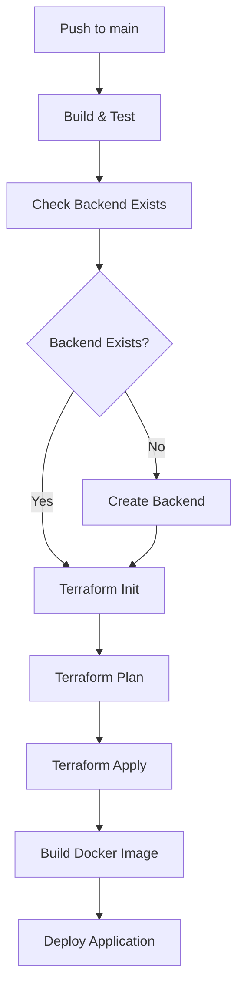

# Terraform State Management Implementation

## ✅ Changes Made

### 1. Added Remote Backend Configuration
- **File**: `terraform/main.tf`
- **Change**: Added `backend "azurerm"` configuration
- **Benefit**: State is now stored in Azure Storage Account instead of locally

### 2. Created Backend Setup Script
- **File**: `scripts/setup-terraform-backend.sh`
- **Purpose**: Automatically creates the required Azure Storage Account for state storage
- **Features**: 
  - Creates dedicated resource group for state storage
  - Enables versioning for state backup/recovery
  - Configures encryption at rest

### 3. Updated CI/CD Pipeline
- **File**: `.github/workflows/ci-cd.yml`
- **Change**: Added backend setup check before `terraform init`
- **Benefit**: Pipeline automatically sets up backend if it doesn't exist

### 4. Added Documentation
- **File**: `docs/terraform-state-management.md`
- **Content**: Comprehensive guide on state management setup and troubleshooting

## 🔧 Technical Details

### Backend Configuration
```hcl
backend "azurerm" {
  resource_group_name  = "rg-terraform-state"
  storage_account_name = "tfstatezoneapi"
  container_name       = "tfstate"
  key                  = "terraform.tfstate"
}
```

### Pipeline Flow


## 🎯 Benefits

### Before (Local State):
- ❌ State lost after each pipeline run
- ❌ Resources recreated each time
- ❌ Resource conflicts and errors
- ❌ No team collaboration
- ❌ No state backup/recovery

### After (Remote State):
- ✅ **Persistent State**: Remembers existing resources
- ✅ **Incremental Updates**: Only creates/updates changed resources
- ✅ **Team Collaboration**: Shared state across team members
- ✅ **State Locking**: Prevents concurrent modifications
- ✅ **Versioning**: Automatic backup and recovery
- ✅ **Security**: Encrypted state storage
- ✅ **Cost Optimization**: No duplicate resources

## 🚀 Next Steps

1. **Test the Pipeline**: Push changes and verify backend setup
2. **Monitor State**: Check Azure Storage Account for state files
3. **Team Onboarding**: Share state management documentation
4. **Environment Expansion**: Consider workspaces for dev/staging/prod

## 🔍 Verification

After deployment, verify the setup:

```bash
# Check if backend storage exists
az storage account show --name tfstatezoneapi --resource-group rg-terraform-state

# Check state file in storage
az storage blob list --account-name tfstatezoneapi --container-name tfstate

# Verify Terraform recognizes the backend
cd terraform && terraform init
```

## 📊 Cost Impact

- **Storage Cost**: ~$0.05/month for state storage
- **Savings**: Prevents duplicate resource creation
- **ROI**: Eliminates resource conflicts and infrastructure inconsistencies 